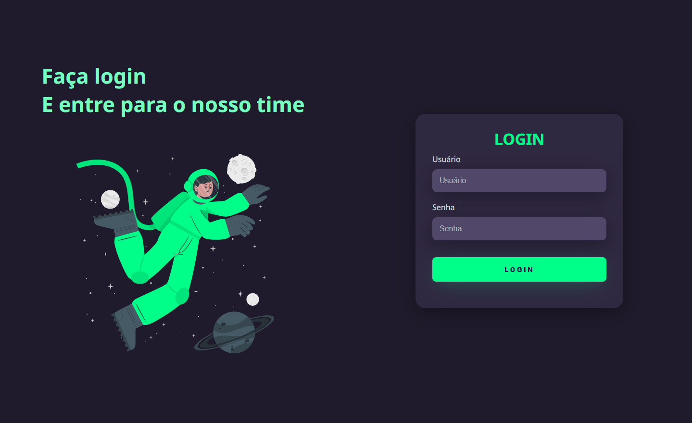
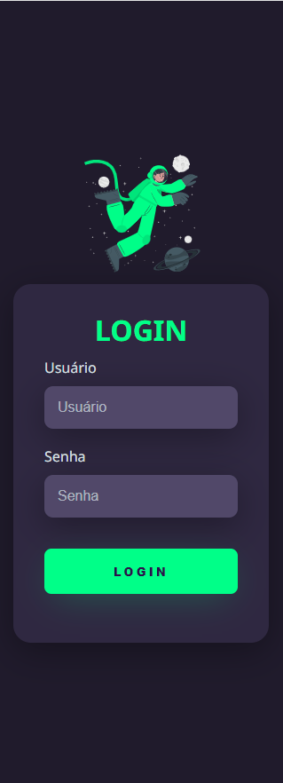
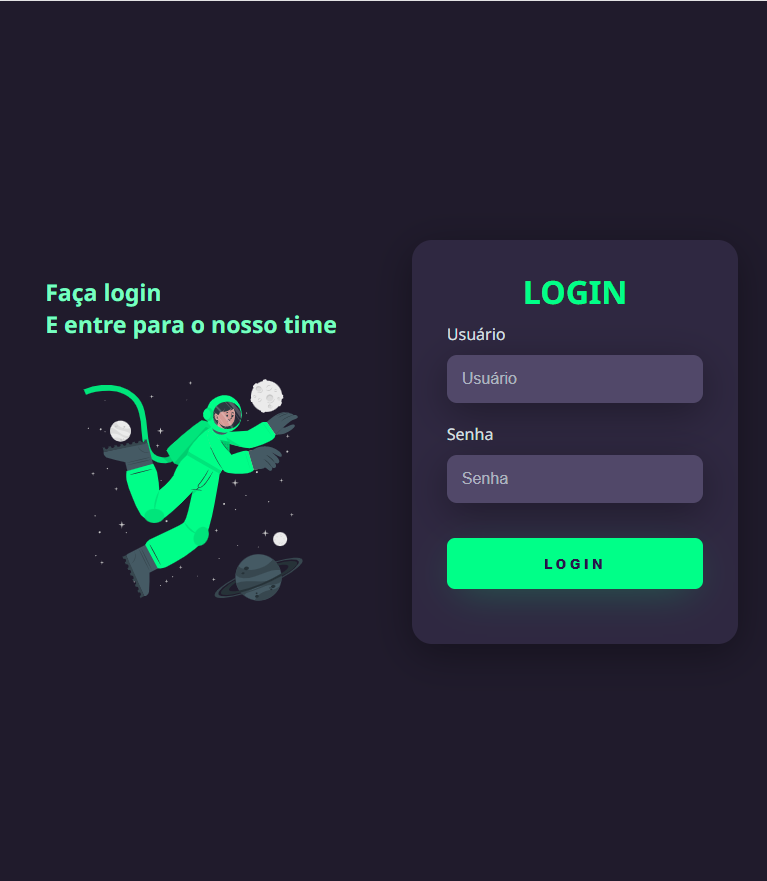

 <a href="#-layout">Layout</a>&nbsp;&nbsp;&nbsp;•&nbsp;&nbsp;&nbsp;
 <a href="#-projeto">Projeto</a>&nbsp;&nbsp;&nbsp;•&nbsp;&nbsp;&nbsp; 
 <a href="#-tecnologias">Tecnologias</a>&nbsp;&nbsp;&nbsp;•&nbsp;&nbsp;&nbsp;
 <a href="#-licença">Licença</a> 

## 🎨 Layout

 

### Computador

  

### Tablet

  

### Mobile

  

## 💻 Projeto

Apenas um outro simples layout de login usando o tema dark com uma imagem animada.

 

## 🚀 Tecnologias

As seguintes ferramentas foram usadas na construção do projeto: 

- HTML
- CSS

 

## 📝 Licença

Este projeto está sobe a licença MIT.
