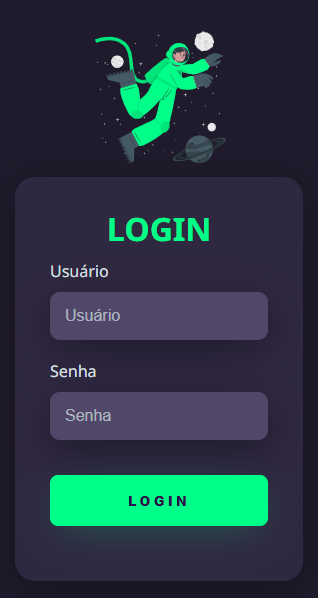
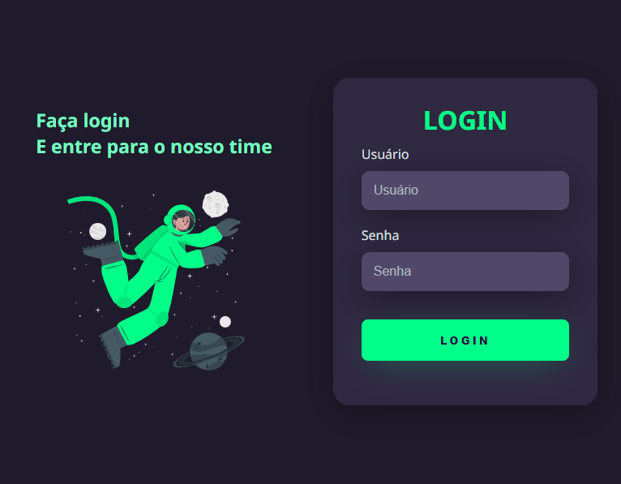

 <a href="#-layout">Layout</a>&nbsp;&nbsp;&nbsp;•&nbsp;&nbsp;&nbsp;
 <a href="#-projeto">Projeto</a>&nbsp;&nbsp;&nbsp;•&nbsp;&nbsp;&nbsp; 
 <a href="#-tecnologias">Tecnologias</a>&nbsp;&nbsp;&nbsp;•&nbsp;&nbsp;&nbsp;
 <a href="#-licença">Licença</a> 

## 🎨 Layout

 

  <h3>Computador</h3>
  

  <h3>Mobile</h3>
  
  <h3>Tablet</h3>
  

## 💻 Projeto

Apenas um simples layout de login 🍙.

 

## 🚀 Tecnologias

As seguintes ferramentas foram usadas na construção do projeto: 

- [HTML](#HTML)
- [CSS](#CSS)

 

## 📝 Licença

Este projeto está sobe a licença MIT.
